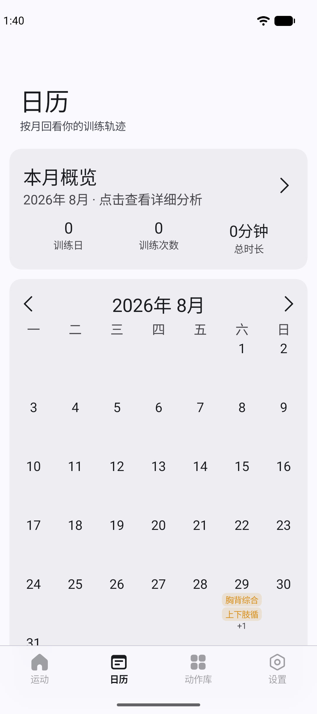
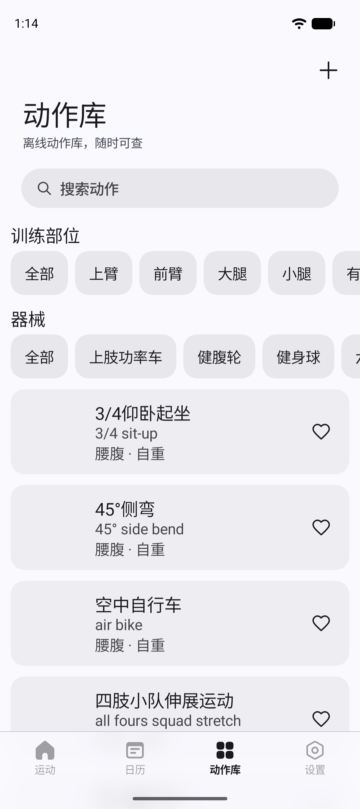

# 练迹

练迹是一款仅支持 Android、离线优先的个人健身计划与训练记录 App。动作数据内置在应用中，运行时无需联网获取。

## 界面预览

<p align="center">
  
  
  
</p>

## 功能

- 创建训练计划，并按日期安排训练
- 记录力量训练的组数、重量、次数和休息时间
- 记录有氧训练的时长、距离和配速
- 浏览离线动作库，查看动作说明和个人最佳记录（PB）
- 通过日历回顾训练历史和月度数据
- 支持自定义动作、主题设置及 JSON 备份恢复

备份恢复采用合并导入，同一份备份不会重复添加记录；未完成训练会作为中断历史保留。备份包含收藏和应用设置，不包含动作媒体。

休息提醒支持离开训练页面后继续工作。可在设置中允许“准时休息提醒”；未允许精确闹钟时，后台提醒可能延迟，通知和震动仍受系统权限及省电策略影响。

## 环境要求

- Android 15（API 35）及以上
- JDK 21
- Android SDK 37

## 构建

克隆项目并使用 Android Studio 打开，或在项目根目录执行：

```powershell
.\gradlew.bat assembleDebug
```

补充应用签名后可构建 Release

```powershell
.\gradlew.bat assembleRelease
```

macOS / Linux：

```bash
./gradlew assembleDebug
```

生成的 APK 位于 `app/build/outputs/apk/debug/app-debug.apk`。

## 第三方内容

- UI 引用了 [MIUIX](https://github.com/compose-miuix-ui/miuix)。
- 动作元数据及说明来自 [hasaneyldrm/exercises-dataset](https://github.com/hasaneyldrm/exercises-dataset)。
- 动作图片与 GIF 归 Gym visual 所有，受授权限制，不包含在本仓库中。
